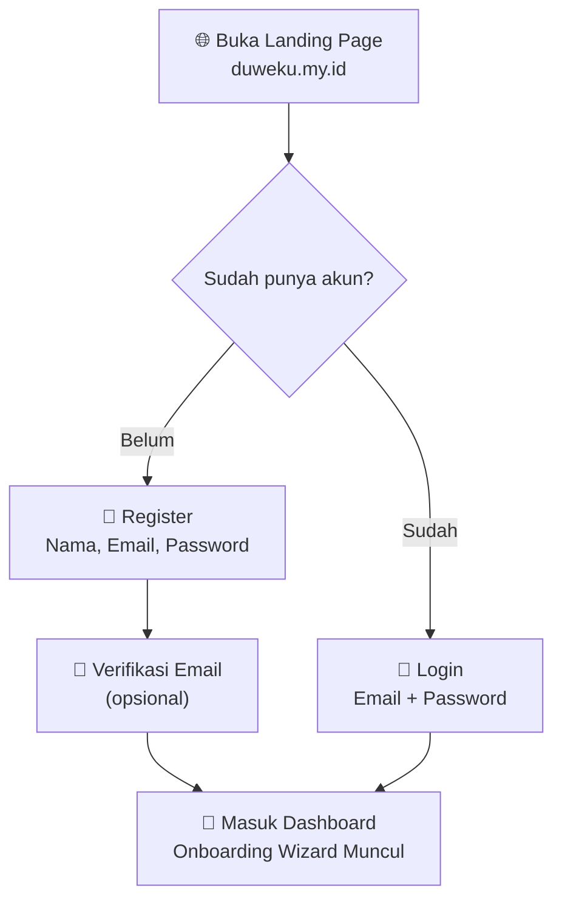
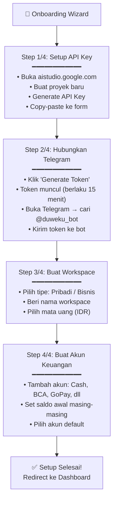
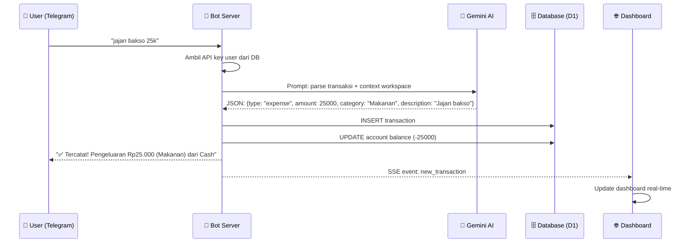
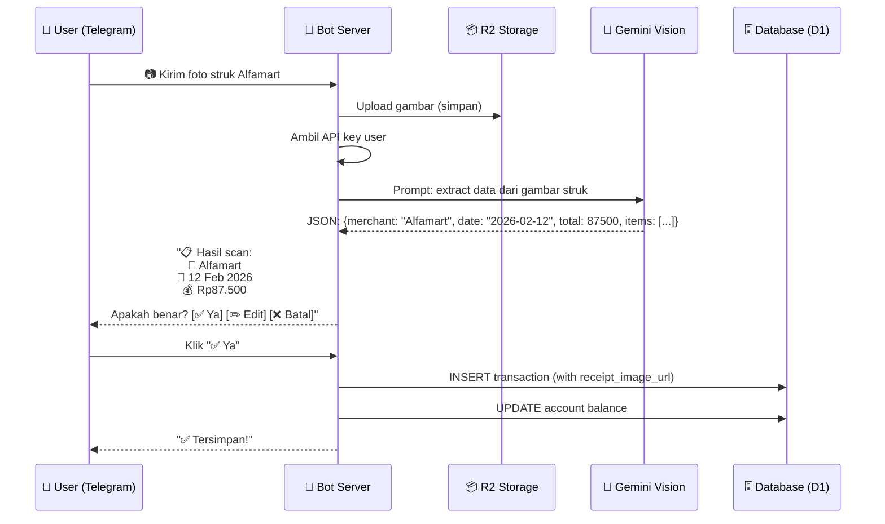
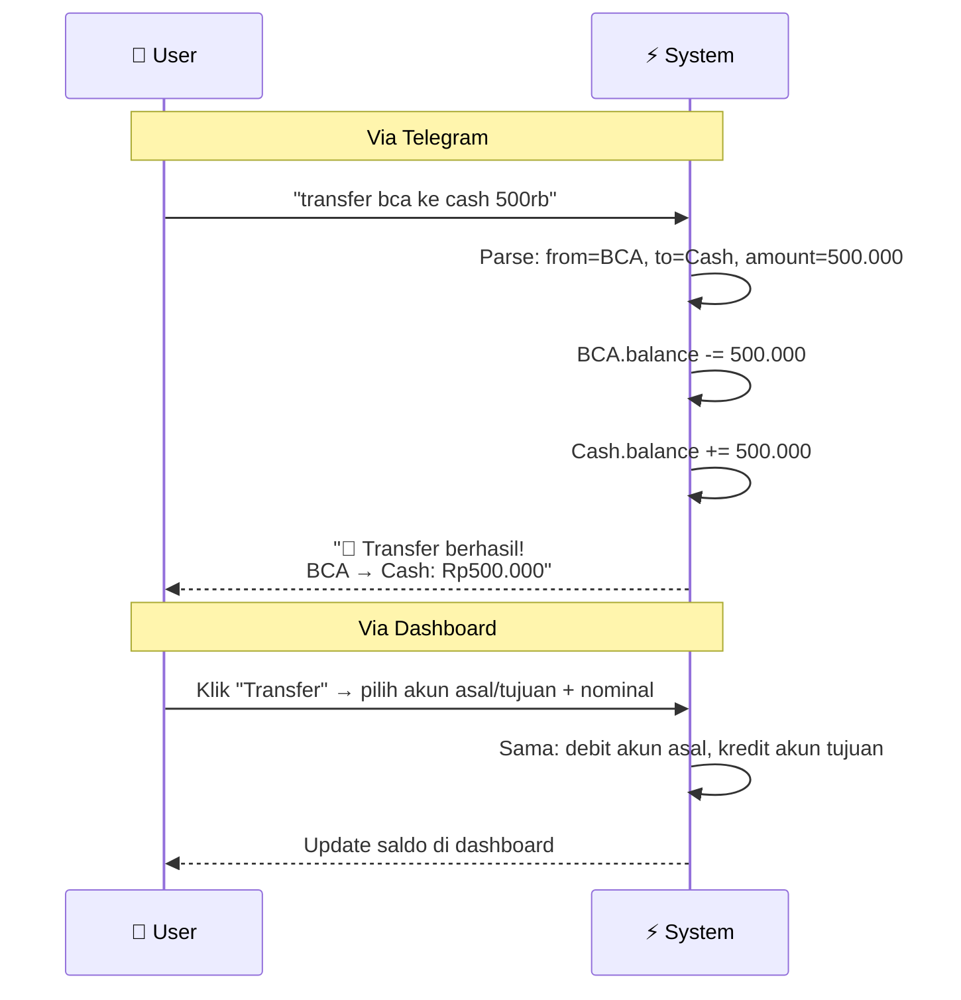
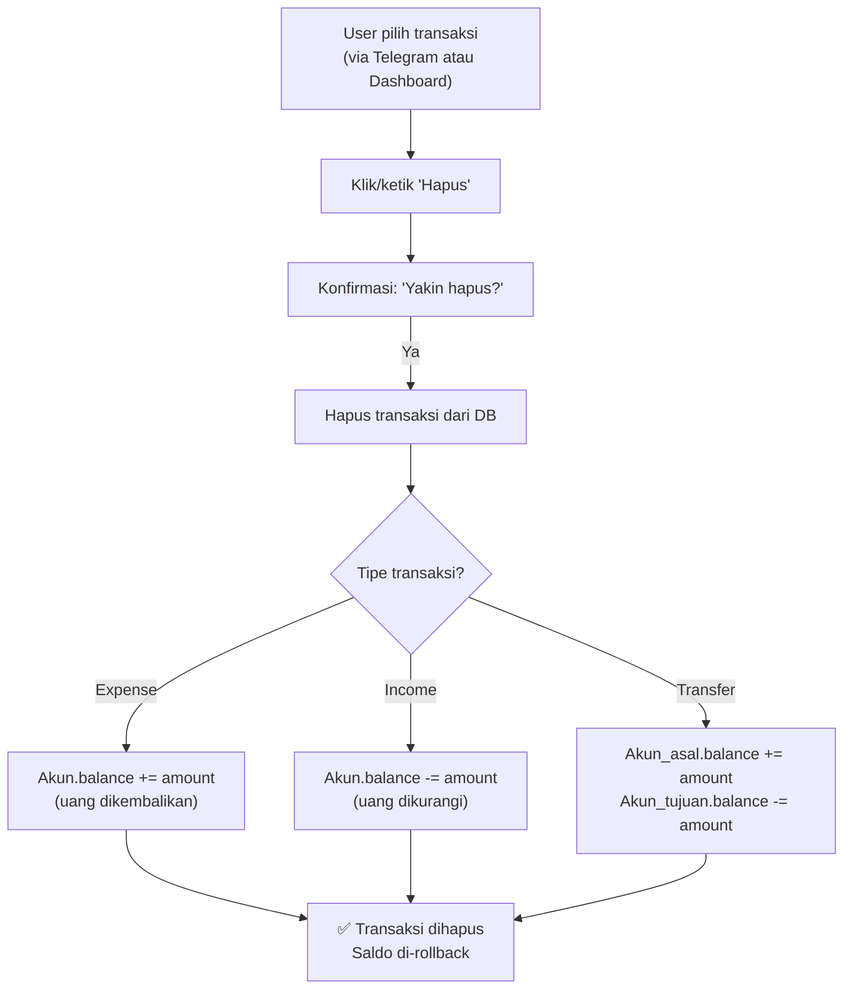
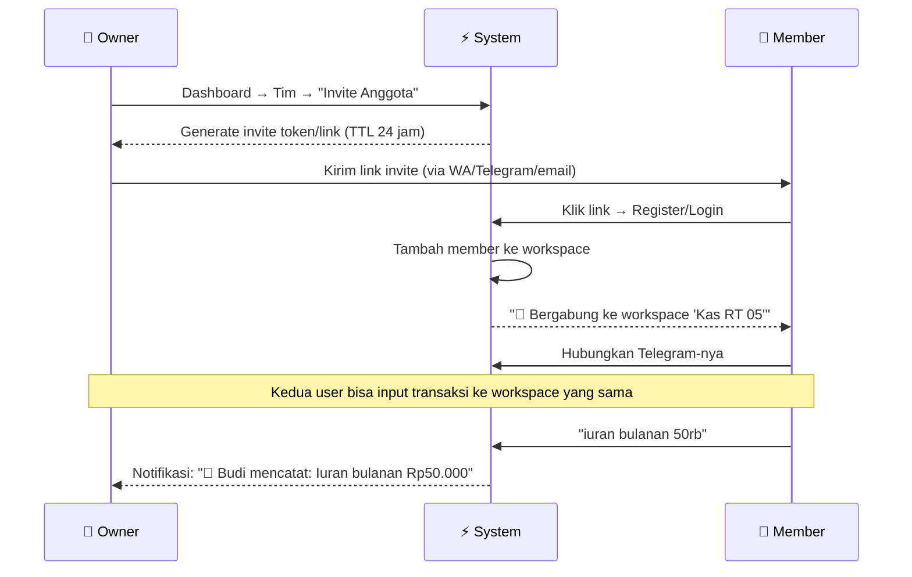
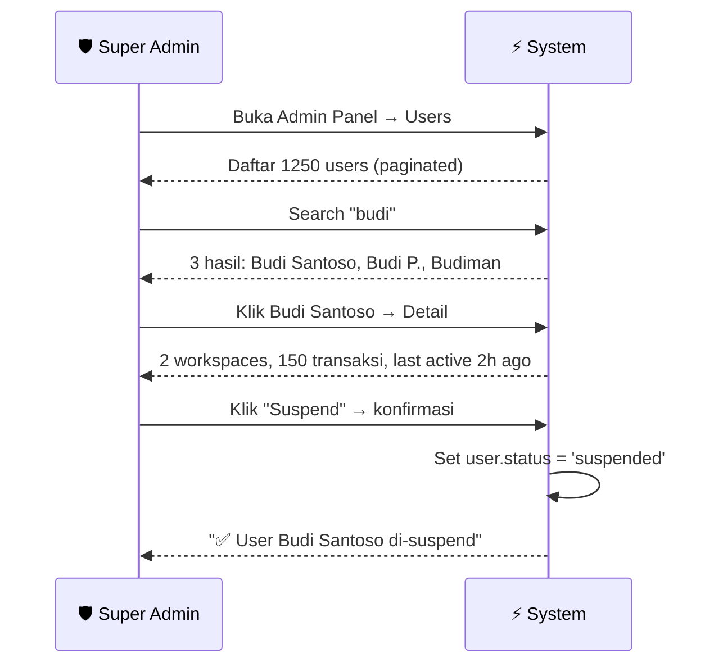

# 02 — User Flow

Dokumen ini menjelaskan alur pengguna lengkap untuk **3 role** (Super Admin, Owner, Member) dari pertama kali menggunakan aplikasi hingga penggunaan harian.

---

## 1. Onboarding Flow (Pengguna Baru)

### 1.1 Registrasi & Setup Awal



### 1.2 Onboarding Wizard (4 Langkah)



### Detail Setiap Langkah

#### Step 1: Setup API Key (BYOK)

**Prasyarat**: Punya akun Google

| # | Aksi User | Sistem |
|---|-----------|--------|
| 1 | Klik link "Buka Google AI Studio" | Redirect ke aistudio.google.com |
| 2 | Login Google → Buat API Key | — |
| 3 | Copy API Key (string alfanumerik panjang) | — |
| 4 | Paste ke input "API Key" di dashboard | Simpan ke DB (terenkripsi) |
| 5 | Klik "Test Koneksi" | Hit Gemini API → tampilkan ✅ / ❌ |
| 6 | (Opsional) Tambah API Key Cadangan | Simpan backup key untuk rotate |

> **Mengapa BYOK?** Biaya AI ditanggung user via kuota gratis Google (60 req/menit). Jika limit tercapai (Error 429), user buat key baru.

#### Step 2: Hubungkan Telegram

| # | Aksi User | Sistem |
|---|-----------|--------|
| 1 | Klik "Hubungkan Telegram" di dashboard | Generate token unik (UUID), simpan di DB, TTL 15 menit |
| 2 | Token muncul di layar + tombol "Copy" | — |
| 3 | Buka Telegram → cari `@duweku_bot` → kirim token | — |
| 4 | — | Webhook menerima pesan: extract `chat_id` + token |
| 5 | — | Validasi token di DB: cek kecocokan + belum expired |
| 6 | — | Simpan `chat_id` ke profil user |
| 7 | — | Bot balas: "✅ Akun terhubung! Ketik /help untuk mulai" |
| 8 | Dashboard otomatis update: "Telegram: Connected ✅" | Real-time via SSE |

> **Keamanan**: Token berumur 15 menit untuk mencegah replay attack.

#### Step 3: Buat Workspace

| # | Aksi User | Sistem |
|---|-----------|--------|
| 1 | Klik "Buat Workspace Baru" | Form muncul |
| 2 | Isi nama: "Keuangan Pribadi" | — |
| 3 | Pilih tipe: Pribadi / Bisnis / Keluarga / Organisasi / Komunitas | — |
| 4 | Klik "Buat" | Simpan workspace, set sebagai active workspace |

#### Step 4: Buat Akun Keuangan

| # | Aksi User | Sistem |
|---|-----------|--------|
| 1 | Klik "+ Tambah Akun" | Form muncul |
| 2 | Isi: Nama (Cash), Tipe (cash), Saldo Awal (500.000) | — |
| 3 | Ulangi untuk BCA (bank, 2.000.000), GoPay (e-wallet, 100.000) | — |
| 4 | Pilih akun default (untuk transaksi tanpa spesifikasi) | Tandai sebagai default |

---

## 2. Daily Use: Catat Transaksi via Teks

### Flow Utama



### Variasi Input yang Didukung

| Input User | AI Parse Result |
|------------|----------------|
| `"makan siang 20rb"` | Expense, 20.000, Makanan |
| `"beli bensin 50k"` | Expense, 50.000, Transportasi |
| `"gaji bulan ini 5jt"` | Income, 5.000.000, Gaji |
| `"bayar listrik 350000"` | Expense, 350.000, Utilitas |
| `"dapat bonus 1.5jt"` | Income, 1.500.000, Bonus |
| `"kopi starbucks 45rb pake gopay"` | Expense, 45.000, Makanan, Akun: GoPay |
| `"transfer bca ke cash 500rb"` | Transfer, 500.000, BCA → Cash |

### Format Angka Indonesia yang Dikenali

| Penulisan | Diparse Menjadi |
|-----------|----------------|
| `25k` | 25.000 |
| `25rb` | 25.000 |
| `25ribu` | 25.000 |
| `5jt` | 5.000.000 |
| `5juta` | 5.000.000 |
| `1.5jt` | 1.500.000 |
| `2000` | 2.000 |
| `350000` | 350.000 |

---

## 3. Catat Transaksi via Gambar (OCR)

### Flow Scan Struk



### Jenis Gambar yang Didukung

| Tipe | Contoh | Data yang Diekstrak |
|------|--------|---------------------|
| **Struk fisik** | Alfamart, Indomaret, minimarket | Merchant, tanggal, total, items |
| **Bukti transfer** | Screenshot m-banking BCA/Mandiri/BRI | Bank pengirim/penerima, nominal, tanggal |
| **Struk digital** | Screenshot Grab/Gojek/Shopee | Merchant, nominal, tanggal |

> **Human-in-the-Loop**: Sistem selalu minta konfirmasi sebelum menyimpan hasil OCR. Ini menjaga integritas data akuntansi.

---

## 4. Fitur Dashboard Web

### Flow Navigasi Dashboard

```
🏠 Dashboard (halaman utama setelah login)
│
├── 📊 Overview
│   ├── Total saldo semua akun
│   ├── Income vs Expense bulan ini
│   ├── Grafik donut per kategori
│   └── Tren harian (line chart)
│
├── 💳 Transaksi
│   ├── Daftar semua transaksi (infinite scroll)
│   ├── Filter: periode, kategori, tipe, akun
│   ├── Search by deskripsi
│   ├── Edit transaksi → update saldo (Owner: semua, Member: milik sendiri)
│   └── Hapus transaksi → rollback saldo (Owner: semua, Member: milik sendiri)
│
├── 💰 Akun (🔒 Owner only)
│   ├── Daftar akun + saldo masing-masing
│   ├── Tambah akun baru
│   ├── Edit akun (nama, ikon)
│   └── Transfer antar akun
│
├── 📋 Laporan (🔒 Owner only)
│   ├── Pilih periode (harian/mingguan/bulanan/custom)
│   ├── Preview laporan
│   └── Download Excel (.xlsx)
│
├── 👥 Tim (🔒 Owner only, jika workspace multi-member)
│   ├── Daftar anggota + role
│   ├── Invite anggota baru (generate token)
│   ├── Remove anggota
│   └── Lihat transaksi per anggota
│
├── 🏢 Workspace
│   ├── Daftar workspace
│   ├── Buat workspace baru (Owner)
│   ├── Switch workspace aktif
│   └── Edit/hapus workspace (🔒 Owner only)
│
├── ⚙️ Pengaturan
│   ├── Profil (nama, email, avatar)
│   ├── API Key (🔒 Owner only)
│   ├── Telegram (status koneksi, re-link)
│   ├── Kategori custom (🔒 Owner only)
│   └── Keamanan (ganti password)
│
└── 🛡️ Admin Panel (🔒 Super Admin only)
    ├── Dashboard platform (total users, growth, AI usage)
    ├── Manage Users (list, suspend, activate, delete)
    ├── Lihat semua workspace (support/debug)
    ├── AI Usage Logs (monitor penggunaan per user)
    └── Platform Settings (maintenance, announcements)
```

---

## 5. Transfer Antar Akun



> **Penting**: Transfer bukan pengeluaran/pemasukan. Kekayaan bersih (net worth) tidak berubah. Hanya perpindahan aset.

---

## 6. Hapus Transaksi & Rollback



---

## 7. Tim Plan Flow (Keluarga / Perusahaan / Instansi / Komunitas)

### Invite Anggota



> **Contoh use case multi-tenant:**
> - 🏠 Keluarga: "Belanja sayur 35rb" → istri & suami lihat bersama
> - 🏢 Perusahaan: "Beli ATK kantor 150rb" → karyawan catat, manager lihat laporan
> - 🏛️ Instansi: "Dana kegiatan workshop 2jt" → bendahara catat, ketua approve
> - 👥 Komunitas: "Iuran futsal 25rb" → semua anggota transparan

---

## 8. Switch Workspace (Telegram)

```
User: /switch
Bot:  "Pilih workspace aktif:
       1️⃣ Pribadi ←(aktif)
       2️⃣ Bisnis Kopi
        3️⃣ Keluarga
        4️⃣ Kas Komunitas RT"

User: Klik "2️⃣ Bisnis Kopi"
Bot:  "✅ Workspace aktif: Bisnis Kopi
       Semua transaksi berikutnya akan dicatat di sini."
```

---

## 9. Error Handling Flow

### API Key Limit (Error 429)

```mermaid
flowchart TD
    A["User kirim chat transaksi"] --> B["Worker panggil Gemini API"]
    B --> C{"Response?"}
    C -->|200 OK| D["Parse & simpan transaksi"]
    C -->|429 Too Many Requests| E["Bot balas: '⚠️ Kuota AI habis!'"]
    E --> F["Saran: 'Buat API key baru di<br/>aistudio.google.com<br/>lalu update di Pengaturan'"]
    F --> G{"Ada backup key?"}
    G -->|Ya| H["Auto-switch ke backup key<br/>Retry request"]
    G -->|Tidak| I["User harus ganti manual"]
---

## 10. Super Admin Flow

### Login Super Admin

```mermaid
flowchart TD
    A["🔐 Login dengan email/password"] --> B{"users.role == 'super_admin'?"}
    B -->|Ya| C["🛡️ Redirect ke Admin Panel"]
    B -->|Tidak| D["👤 Redirect ke User Dashboard"]
```

### Admin Panel Navigation

```
🛡️ Admin Panel
│
├── 📊 Platform Dashboard
│   ├── Total users (registered, active 30d)
│   ├── New users (7d, 30d) + growth chart
│   ├── Total transaksi platform
│   ├── AI requests hari ini
│   └── Top kategori pengeluaran
│
├── 👥 Manage Users
│   ├── Daftar semua user (search, filter, pagination)
│   ├── Detail user (workspaces, transaksi, AI usage)
│   ├── Suspend user → user tidak bisa login
│   ├── Activate user → restore akses
│   └── Delete user → CASCADE semua data
│
├── 📈 AI Usage
│   ├── Total requests per hari/minggu/bulan
│   ├── Per-user breakdown
│   ├── Rata-rata latency
│   └── Error rate (429, timeout, dll)
│
└── ⚙️ Platform Settings
    ├── Maintenance mode (on/off)
    ├── Max workspaces per user
    ├── Announcement banner
    └── Default kategori baru
```

### Super Admin Manage User


