# 03 — Data Structure

Struktur data lengkap DuweKu menggunakan **Cloudflare D1** (SQLite) dan **R2** (object storage).

---

## 1. ERD Overview


---

## 2. Tabel `users`

| Kolom | Tipe | Keterangan |
|-------|------|------------|
| `id` | TEXT PK | UUID |
| `email` | TEXT UNIQUE | Email login |
| `password_hash` | TEXT | Bcrypt hash |
| `name` | TEXT | Nama tampilan |
| `role` | TEXT | **`super_admin` / `user`** — role level platform |
| `plan_id` | TEXT FK | → plans.id (paket langganan aktif) |
| `ai_mode` | TEXT | **`byok` / `global`** — mode API key AI |
| `status` | TEXT | `active` / `suspended` — akun status |
| `telegram_chat_id` | TEXT UNIQUE | ID Telegram numerik |
| `telegram_link_token` | TEXT | Token handshake (TTL 15 menit) |
| `telegram_token_expires` | TEXT | ISO datetime expiry |
| `gemini_api_key` | TEXT | Encrypted AES-256 (**hanya jika ai_mode = 'byok'**) |
| `gemini_api_key_backup` | TEXT | Key cadangan, encrypted (**hanya jika ai_mode = 'byok'**) |
| `avatar_url` | TEXT | Nullable |
| `active_workspace_id` | TEXT FK | Workspace aktif saat ini |
| `created_at` | TEXT | ISO datetime |
| `updated_at` | TEXT | ISO datetime |

**Index**: `email`, `telegram_chat_id`

> **Catatan**:
> - `role` membedakan **Super Admin** (platform) dari **User** biasa. Role **Owner/Member** ada di `workspace_members`.
> - `ai_mode` menentukan sumber API key: `byok` = key user sendiri (isolate), `global` = key platform.
> - Kolom `gemini_api_key` hanya perlu diisi jika `ai_mode = 'byok'`.

---

## 3. Tabel `plans` (Paket Langganan)

| Kolom | Tipe | Keterangan |
|-------|------|------------|
| `id` | TEXT PK | UUID |
| `name` | TEXT | "Basic (BYOK)", "Pro (AI Included)" |
| `slug` | TEXT UNIQUE | `basic-byok`, `pro-ai` |
| `ai_mode` | TEXT | `byok` / `global` — default ai_mode saat subscribe |
| `price_monthly` | REAL | Harga bulanan (IDR) |
| `price_yearly` | REAL | Harga tahunan (IDR), nullable |
| `features` | TEXT | JSON array of feature strings |
| `max_workspaces` | INTEGER | Batas workspace per user |
| `max_transactions` | INTEGER | Batas transaksi/bulan, -1 = unlimited |
| `is_active` | INTEGER | 1=tersedia, 0=discontinued |
| `sort_order` | INTEGER | Urutan tampilan |
| `created_at` | TEXT | ISO datetime |

### Contoh Data Plans

| Paket | AI Mode | Harga | Max Workspace | Max Transaksi |
|-------|---------|-------|---------------|---------------|
| 🟢 Basic (BYOK) | `byok` | Rp 200.000 (selamanya) | 5 | Unlimited |
| 🔵 Pro (AI Included) | `global` | Rp 30.000/bulan | 10 | Unlimited |

---

## 3. Tabel `workspaces`

| Kolom | Tipe | Keterangan |
|-------|------|------------|
| `id` | TEXT PK | UUID |
| `name` | TEXT | "Pribadi", "Bisnis Kopi" |
| `type` | TEXT | `personal` / `business` / `family` / `organization` / `community` |
| `currency` | TEXT | Default: `IDR` |
| `owner_id` | TEXT FK | → users.id |
| `created_at` | TEXT | ISO datetime |
| `updated_at` | TEXT | ISO datetime |

---

## 4. Tabel `workspace_members`

| Kolom | Tipe | Keterangan |
|-------|------|------------|
| `id` | TEXT PK | UUID |
| `workspace_id` | TEXT FK | → workspaces.id (CASCADE) |
| `user_id` | TEXT FK | → users.id |
| `role` | TEXT | **`owner` / `member`** — role level workspace |
| `joined_at` | TEXT | ISO datetime |

**Constraint**: UNIQUE(workspace_id, user_id) — user hanya bisa join 1x per workspace

---

## 5. Tabel `accounts`

| Kolom | Tipe | Keterangan |
|-------|------|------------|
| `id` | TEXT PK | UUID |
| `workspace_id` | TEXT FK | → workspaces.id (CASCADE) |
| `name` | TEXT | "Cash", "BCA", "GoPay" |
| `type` | TEXT | `cash` / `bank` / `e-wallet` |
| `initial_balance` | REAL | Saldo awal (titik referensi) |
| `current_balance` | REAL | Saldo saat ini (computed) |
| `icon` | TEXT | Emoji: 💰, 🏦 |
| `sort_order` | INTEGER | Urutan tampilan |
| `is_active` | INTEGER | 1=aktif, 0=arsip |
| `is_default` | INTEGER | 1=akun default transaksi |
| `created_at` | TEXT | ISO datetime |
| `updated_at` | TEXT | ISO datetime |

**Logika Saldo**: `current_balance` = `initial_balance` + SUM(income) - SUM(expense) ± transfers

---

## 6. Tabel `categories`

| Kolom | Tipe | Keterangan |
|-------|------|------------|
| `id` | TEXT PK | UUID |
| `workspace_id` | TEXT FK | → workspaces.id (CASCADE) |
| `name` | TEXT | "Makanan", "Transportasi" |
| `type` | TEXT | `income` / `expense` |
| `icon` | TEXT | Emoji |
| `color` | TEXT | Hex color |
| `sort_order` | INTEGER | Urutan tampilan |
| `is_system` | INTEGER | 1=bawaan sistem |
| `is_active` | INTEGER | 1=aktif |

### Kategori Default

**Expense**: 🍕 Makanan, 🚗 Transportasi, 🛍️ Belanja, ⚡ Utilitas, 🎮 Hiburan, 💊 Kesehatan, 📚 Pendidikan, 📦 Lainnya

**Income**: 💰 Gaji, 🎁 Bonus, 📈 Investasi, 💻 Freelance, 📦 Lainnya

---

## 7. Tabel `transactions`

| Kolom | Tipe | Keterangan |
|-------|------|------------|
| `id` | TEXT PK | UUID |
| `workspace_id` | TEXT FK | → workspaces.id (CASCADE) |
| `account_id` | TEXT FK | → accounts.id |
| `category_id` | TEXT FK | Nullable (null untuk transfer) |
| `user_id` | TEXT FK | → users.id (siapa yang input) |
| `type` | TEXT | `income` / `expense` / `transfer` |
| `amount` | REAL | Selalu positif |
| `description` | TEXT | "Jajan bakso" |
| `raw_input` | TEXT | Pesan asli: "jajan bakso 25k" |
| `source` | TEXT | `telegram_text` / `telegram_image` / `web_manual` |
| `receipt_image_key` | TEXT | R2 object key, nullable |
| `transfer_to_account_id` | TEXT FK | Nullable, → accounts.id |
| `date` | TEXT | `YYYY-MM-DD` |
| `created_at` | TEXT | ISO datetime |
| `updated_at` | TEXT | ISO datetime |

**Index**: `workspace_id`, `account_id`, `date`, `type`, `(workspace_id, date)` composite

---

## 8. Tabel `ai_logs`

| Kolom | Tipe | Keterangan |
|-------|------|------------|
| `id` | TEXT PK | UUID |
| `user_id` | TEXT FK | → users.id |
| `workspace_id` | TEXT FK | → workspaces.id |
| `raw_input` | TEXT | Teks/referensi gambar asli |
| `ai_response` | TEXT | Full JSON dari Gemini |
| `parsed_result` | TEXT | Structured extraction |
| `was_confirmed` | INTEGER | 1=user konfirmasi benar |
| `tokens_used` | INTEGER | Token terpakai |
| `model` | TEXT | gemini-pro / gemini-pro-vision |
| `processing_ms` | INTEGER | Latency ms |
| `created_at` | TEXT | ISO datetime |

---

## 9. R2 Storage Structure

```
Bucket: duweku-storage
├── receipts/{workspace_id}/{transaction_id}.jpg   ← Foto struk
├── exports/{workspace_id}/laporan_2026-02.xlsx    ← Temp (auto-delete 24h)
└── avatars/{user_id}.jpg                          ← Foto profil
```

---

## 10. Hierarki Role (3 Tingkatan)

Aplikasi ini adalah **SaaS** dengan 3 tingkatan role:

```mermaid
graph TD
    SA["🛡️ Super Admin<br/>(Platform Level)"] --> OW["👑 Owner<br/>(Workspace Level)"]
    OW --> MB["👤 Member<br/>(Workspace Level)"]
```



### Role 1: 🛡️ Super Admin

**Level**: Platform (disimpan di `users.role = 'super_admin'`)

| Hak Akses | Keterangan |
|-----------|------------|
| Lihat semua user | Dashboard admin: daftar semua user terdaftar |
| Manage user | Suspend, activate, delete user |
| Lihat statistik global | Total user, total transaksi, growth metrics |
| Manage platform settings | Konfigurasi global, announcement |
| Akses semua workspace | Untuk keperluan support/debugging |
| Lihat AI usage logs | Monitor penggunaan AI seluruh platform |

### Role 2: 👑 Owner

**Level**: Workspace (disimpan di `workspace_members.role = 'owner'`)

| Hak Akses | Keterangan |
|-----------|------------|
| Full CRUD workspace | Buat, edit, hapus workspace |
| Invite & remove member | Kelola anggota tim workspace |
| CRUD akun keuangan | Tambah/edit/hapus bank, e-wallet |
| CRUD kategori | Tambah/edit kategori custom |
| CRUD semua transaksi | Input, edit, hapus transaksi siapapun |
| Export laporan | Download Excel |
| Lihat semua data workspace | Full visibility |
| Setting API key & Telegram | Konfigurasi integrasi |

### Role 3: 👤 Member

**Level**: Workspace (disimpan di `workspace_members.role = 'member'`)

| Hak Akses | Keterangan |
|-----------|------------|
| Input transaksi | Catat pengeluaran/pemasukan sendiri |
| Lihat semua transaksi | Transparansi (termasuk transaksi member lain) |
| Lihat dashboard & saldo | Read-only analytics |
| Edit/hapus transaksi sendiri | Hanya transaksi yang dia buat |
| ❌ Tidak bisa invite member | Owner only |
| ❌ Tidak bisa hapus workspace | Owner only |
| ❌ Tidak bisa manage akun/kategori | Owner only |
| ❌ Tidak bisa export laporan | Owner only |

### Matriks Perbandingan

| Fitur | Super Admin | Owner | Member |
|-------|:-----------:|:-----:|:------:|
| Admin dashboard platform | ✅ | ❌ | ❌ |
| Manage semua user | ✅ | ❌ | ❌ |
| Buat workspace | ✅ | ✅ | ❌ |
| Hapus workspace | ✅ | ✅ | ❌ |
| Invite member | ✅ | ✅ | ❌ |
| CRUD akun keuangan | ✅ | ✅ | ❌ |
| CRUD kategori | ✅ | ✅ | ❌ |
| Input transaksi | ✅ | ✅ | ✅ |
| Hapus semua transaksi | ✅ | ✅ | ❌ |
| Hapus transaksi sendiri | ✅ | ✅ | ✅ |
| Lihat dashboard | ✅ | ✅ | ✅ |
| Export laporan | ✅ | ✅ | ❌ |
| Setting API key | ✅ | ✅ | ❌ |

---

## 11. Integrity Rules

| Rule | Implementasi |
|------|-------------|
| Super Admin cek via `users.role` | Middleware auth: `requireSuperAdmin()` |
| Owner/Member cek via `workspace_members.role` | Middleware: `requireWorkspaceRole('owner')` |
| User hanya akses workspace yang dia member | Cek `workspace_members` di middleware |
| Hapus transaksi → rollback saldo | Application logic |
| Hapus workspace → cascade semua data | `ON DELETE CASCADE` |
| Transfer harus 2 akun berbeda | Validate di API |
| 1 default account per workspace | Enforce di API |
| Member hanya hapus transaksi sendiri | `WHERE user_id = currentUser.id` |
